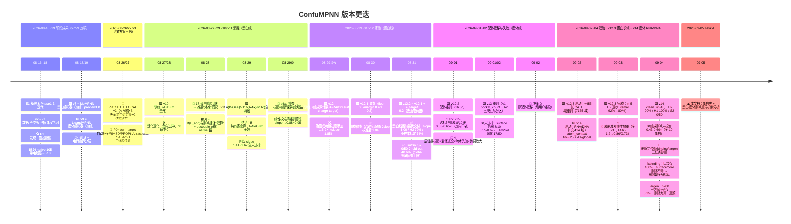

# Task A 时间线 — 蛋白模式（MoMPNN）与配体模式（LigandMPNN）版本更迭（2026-08→09）

> 配套主报告：`analysis/report/2026-09-05_protein_history_vs_ligand_deletion.md`
> 图例：🟦 蛋白线（MoMPNN backbone）｜🟨 配体线（LigandMPNN backbone）｜🔧 通用机制/修复

## 一句话版本线
- 🟦 **蛋白线（MoMPNN）**：v7（无组成监督，P1 删减 105→18）→ v10/v11（A+B+C 失败与消融，B 弃）→ v12（组成 floor，过度添加）→ v12.1（调参）→ **v12.2（+λ_target 表面电荷锚，最优）** → v12.3（加长域，覆盖内退步未采纳）。
- 🟨 **配体线（LigandMPNN）**：v9（旧边界）→ v12.2-ligand（删减 0.53-0.65×）→ v13（A1 护口袋，surface 仍删）→ **v14（RNA/DNA + A1-global，删减 0.43-0.69× 仍未根治）**。
- 🔧 **贯穿机制**：删减捷径（成对删 D+K 保净电荷）自 v7 即存在；v12 起的"表面 floor + GRAVY + λ_target"把蛋白模式压到"轻删/均匀"，配体模式因深口袋盲区×疏水先验仍在逃逸。
